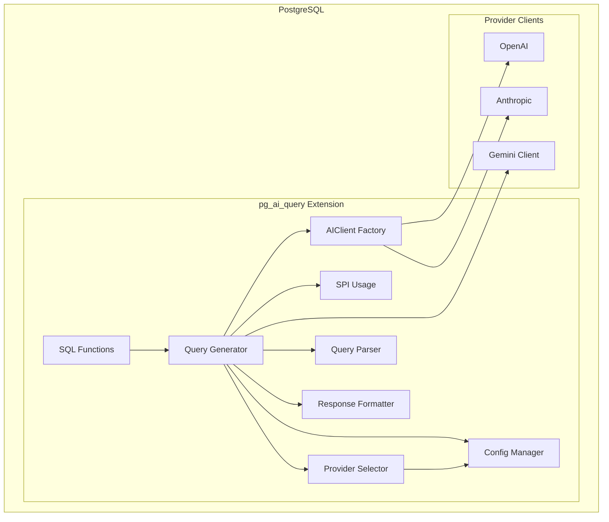
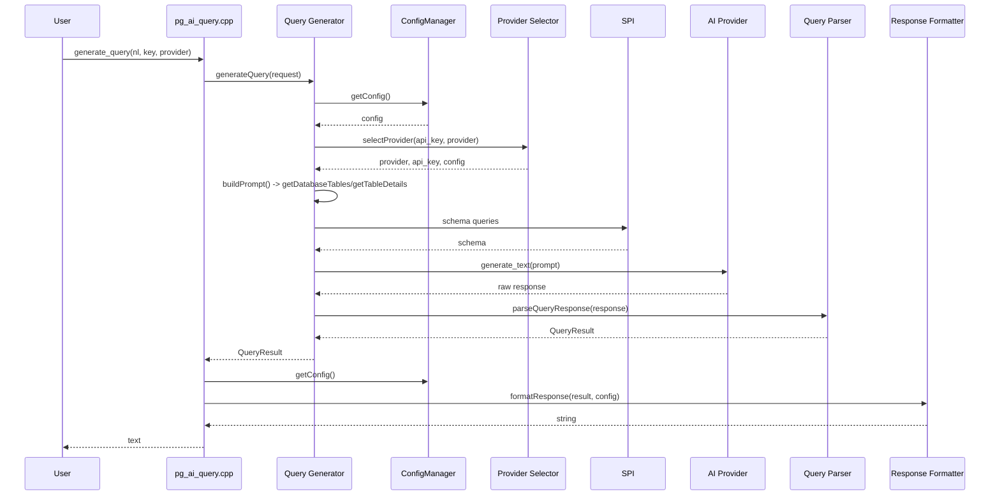

# Architecture Overview

This document describes the high-level architecture of the pg_ai_query extension: how components interact, how data flows from user calls to generated SQL, and how AI providers are integrated.

## High-Level Diagram

**Legend:**

- **SQL Functions**: Entry points (`generate_query`, `get_database_tables`, `get_table_details`, `explain_query`) defined in `sql/pg_ai_query--1.0.sql` and implemented in `src/pg_ai_query.cpp`.
- **Query Generator**: Central orchestrator; drives provider selection, prompt building, schema fetch via SPI, AI call, parsing, and formatting.
- **Provider Selector**: Resolves provider (openai / anthropic / gemini / auto) and API key from parameters and config.
- **AIClient Factory**: Instantiates OpenAI and Anthropic clients via ai-sdk-cpp; Gemini is not created here.
- **Provider Clients**: OpenAI and Anthropic use the shared `ai::Client` from the SDK; Gemini uses a custom client in `src/providers/gemini/`.

## Component Descriptions

### pg_ai_query.cpp

**Location:** `src/pg_ai_query.cpp`

Extension entry point and PostgreSQL function registration. Declares the four exported functions with `PG_FUNCTION_INFO_V1()` and implements them:

- **generate_query(text, text, text)**: Converts PG arguments to C++ (`QueryRequest`), calls `QueryGenerator::generateQuery()`, then `ResponseFormatter::formatResponse()` with `ConfigManager::getConfig()`, and returns the formatted text (or reports errors via `ereport`).
- **get_database_tables()**: Calls `QueryGenerator::getDatabaseTables()`, serializes the result to JSON, returns text.
- **get_table_details(text, text)**: Calls `QueryGenerator::getTableDetails()`, serializes to JSON, returns text.
- **explain_query(text, text, text)**: Builds `ExplainRequest`, calls `QueryGenerator::explainQuery()`, returns the AI explanation text.

All functions use `ereport(ERROR, ...)` on failure and handle C++ exceptions.

### Query Generator

**Location:** `src/core/query_generator.cpp`

The central orchestrator for query generation and related operations.

**Query generation flow:** (1) Validate input; (2) call `ProviderSelector::selectProvider()`; (3) build user prompt via `buildPrompt()` (which calls `getDatabaseTables()`, then for up to three mentioned tables `getTableDetails()`, and formats schema with `formatSchemaForAI()` / `formatTableDetailsForAI()`); (4) if Gemini, call `gemini::GeminiClient::generate_text()`; otherwise call `AIClientFactory::createClient()` then `client.generate_text()`; (5) parse AI response with `QueryParser::parseQueryResponse()` and return `QueryResult`.

**Other responsibilities:** Implements `getDatabaseTables()` and `getTableDetails()` using raw `SPI_connect` / `SPI_execute` / `SPI_finish` to query `information_schema` and `pg_indexes`. Implements `explainQuery()`: uses `SPIConnection` to run `EXPLAIN (ANALYZE, ...)`, then uses the same provider selection and Gemini vs OpenAI/Anthropic branching to send the EXPLAIN output to the AI for analysis. System prompts come from `src/prompts.cpp` (`SYSTEM_PROMPT`, `EXPLAIN_SYSTEM_PROMPT`).

### AI Client Factory

**Location:** `src/core/ai_client_factory.cpp`

Creates AI clients for **OpenAI** and **Anthropic** only. `createClient(provider, api_key, provider_config)` returns an `AIClientResult` containing an `ai::Client` (from ai-sdk-cpp) and the model name. Uses `provider_config` for custom endpoint, default model, max_tokens, and temperature when provided. Gemini is not handled here; the Query Generator calls the Gemini client directly.

### Provider Selector

**Location:** `src/core/provider_selector.cpp`

Resolves which provider and API key to use. `selectProvider(api_key, provider_preference)`:

- If `provider_preference` is `"openai"`, `"anthropic"`, or `"gemini"`, that provider is selected and the API key is taken from the parameter or from config for that provider.
- Otherwise (e.g. `"auto"`), `autoSelectProvider()` runs: if an API key was passed, OpenAI is chosen; if not, the first configured provider with a non-empty API key is used (order: OpenAI → Anthropic → Gemini).

Returns a `ProviderSelectionResult` (provider, config pointer, api_key, success, error_message). Config is read via `ConfigManager::getProviderConfig()`.

### Response Formatter

**Location:** `src/core/response_formatter.cpp`

Formats `QueryResult` for display. `formatResponse(result, config)` chooses output style from `config.use_formatted_response`: JSON (e.g. `createJSONResponse`) or plain text with SQL-style comments (e.g. `createPlainTextResponse`). Which fields appear (explanation, warnings, suggested visualization) is controlled by configuration. Used by `pg_ai_query.cpp` for the return value of `generate_query`.

### Query Parser

**Location:** `src/core/query_parser.cpp`

Parses raw LLM output into a structured `QueryResult`. `parseQueryResponse(response_text)` extracts JSON from the response (markdown code block with optional `json` language tag, or raw JSON), then maps fields to `QueryResult` (e.g. generated_query, explanation, warnings). Helpers: `accessesSystemTables(sql)` detects access to `information_schema` or `pg_catalog`; `hasErrorIndicators(explanation, warnings)` helps detect error conditions. Designed to be testable without PostgreSQL.

### SPI Connection

**Location:** `src/core/spi_connection.cpp`

RAII wrapper for PostgreSQL SPI: `SPIConnection` connects on construction and disconnects on destruction, so connections are cleaned up on exceptions. `SPIValue` wraps a `char*` returned from SPI and frees it with `pfree` on destruction. Used in `QueryGenerator::explainQuery()` for running EXPLAIN. Schema-related queries in the same file use direct `SPI_connect` / `SPI_finish` instead of `SPIConnection`.

### Config

**Location:** `src/config.cpp`

`ConfigManager` loads configuration lazily: the first call to `getConfig()` or `getProviderConfig()` triggers `loadConfig()`, which reads `~/.pg_ai.config` (INI format) or a given path, parses it into `Configuration`, and applies environment overrides (placeholder). `Configuration` holds the list of provider configs (with api_key, default_model, endpoint, etc.), general settings (logging, timeouts), query defaults (e.g. enforce_limit, default_limit), and response-format flags (show_explanation, use_formatted_response, etc.). Used across the extension for provider selection, formatting, and AI client creation.

## Data Flow

### generate_query

End-to-end flow when the user calls `generate_query(natural_language_query, api_key, provider)`:

1. **Entry**: `pg_ai_query.cpp` receives the arguments and builds a `QueryRequest`.
2. **Config loaded**: When `QueryGenerator` or later code needs config, `ConfigManager::getConfig()` runs and, if not already loaded, loads `~/.pg_ai.config`.
3. **Provider selection**: `ProviderSelector::selectProvider(api_key, provider)` returns the provider (openai / anthropic / gemini), API key, and optional `ProviderConfig`.
4. **Schema fetched**: Inside `buildPrompt()`, `getDatabaseTables()` runs SPI queries to list tables; for up to three tables mentioned in the natural language, `getTableDetails()` fetches columns and indexes. Results are formatted with `formatSchemaForAI()` and `formatTableDetailsForAI()` into a schema context string.
5. **Prompt built**: System prompt from `prompts.cpp` and user prompt (request + schema context) are combined.
6. **AI called**: If the selected provider is Gemini, `gemini::GeminiClient::generate_text()` is used. Otherwise `AIClientFactory::createClient()` is called, then `client.generate_text(options)` from the SDK.
7. **Response parsed**: `QueryParser::parseQueryResponse(ai_response_text)` produces a `QueryResult`.
8. **Formatted**: `ResponseFormatter::formatResponse(result, config)` produces the final string (JSON or plain text).
9. **Returned**: The extension returns this string to the client; on failure it uses `ereport(ERROR, ...)`.

### Other entry points

- **get_database_tables** / **get_table_details**: Call `QueryGenerator::getDatabaseTables()` or `getTableDetails()` only; no provider selection or AI. Results are serialized to JSON in `pg_ai_query.cpp` and returned.
- **explain_query**: Builds an `ExplainRequest`, then `QueryGenerator::explainQuery()` runs EXPLAIN via SPI (using `SPIConnection`), gets the EXPLAIN output, and sends it to the same provider selection and AI path (Gemini vs OpenAI/Anthropic) for analysis. The AI explanation text is returned directly (no ResponseFormatter).

## Provider Architecture

### Unified usage

All providers are used for the same kind of task: “generate text” — either a SQL query (and metadata) or an explanation of an EXPLAIN plan. The flow is always: `ProviderSelector` chooses provider and API key; then either the **Gemini path** (custom client) or the **OpenAI/Anthropic path** (AIClientFactory + ai-sdk-cpp client).

### OpenAI and Anthropic

Implemented via the **ai-sdk-cpp** library. There is no separate “base interface” in the extension; the common interface is the SDK’s `ai::Client` and `client.generate_text(options)`. `AIClientFactory::createClient()` returns an `ai::Client` (created with `ai::openai::create_client` or `ai::anthropic::create_client`) plus the model name. Configuration (endpoint, model, temperature, max_tokens) is taken from the selected `ProviderConfig` when present.

### Gemini

Implemented with a **custom client** in `src/providers/gemini/` and `src/include/gemini_client.h`. `GeminiClient::generate_text(GeminiRequest)` performs its own HTTP requests and JSON handling. When `ProviderSelector` returns `Provider::GEMINI`, `QueryGenerator` branches and calls this client directly; it does not use `AIClientFactory`. The same branching is used in `explainQuery()`.

### Adding a new provider

1. **Config**: Add a new enum value in `src/include/config.hpp` and the corresponding section/constants (e.g. provider name string, default endpoint).
2. **Selection**: In `src/core/provider_selector.cpp`, handle the new provider name in `selectProvider()` and in `autoSelectProvider()` (order of fallback when using config-only keys).
3. **Client creation and usage**: Either:
   - **Via ai-sdk-cpp**: Add a case in `AIClientFactory::createClient()` that returns an `ai::Client` for the new provider, and ensure `QueryGenerator` uses that path for the new provider (no extra branch if the SDK already exposes a factory), or
   - **Custom client (like Gemini)**: Implement a client (e.g. in `src/providers/<name>/`) and add a branch in `QueryGenerator::generateQuery()` and `QueryGenerator::explainQuery()` that calls the new client when the selected provider is the new one.
4. **Documentation**: Update [providers.md](./providers.md) and this architecture document to describe the new provider and any special wiring.
